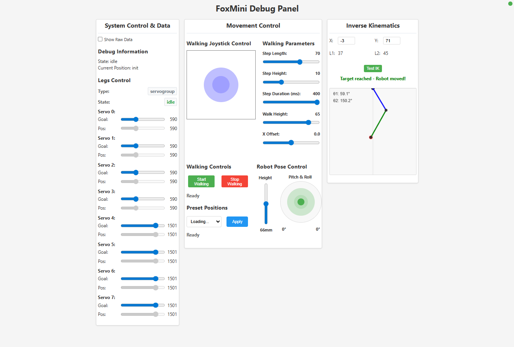

# 🤖 FoxMini - WiFi-Controlled Quadruped Robot

A 4-legged robot built with ESP8266 (D1 Mini) that you can control over WiFi API and debug web interface.

Watch the creation process and demo video:

[](https://www.youtube.com/watch?v=Um8Rtv28zdM)

## 🚀 Features

- [x] **OTA Updates**: Update the robot's software over WiFi
- [x] **WiFi Control**: Control the robot from your phone or computer
- [x] **Preset Positions**: Quick poses like standing, sitting, etc.
- [x] **Body Control**: Control robot body height, roll, and pitch
- [x] **Leg Control**: Move legs using inverse kinematics
- [x] **Walking**: Create gait patterns for movement in all directions
- [x] **Web Interface**: Debug / control panel
- [ ] **Add motorized wheel at the end of the foot**

**Note:** If you are aware this is still a work in progress, but want to get a prototype PCB as in the video, feel free to contact us.

## 🏗️ Hardware & Specifications

- **ESP8266 D1 Mini** - The brain of the robot
- **PCA9685 PWM Servo Driver** - Controls the servo motors via I2C
- **8 Servo Motors** - 2 for each leg

**Robot Specs:**

- **Dimensions**: Base width: 45mm, Base length: 89mm, Leg segments: 37mm + 45mm
- **Legs**: 4 legs with 2 servos each (hip + knee)
- **Control**: WiFi via ESP8266 web server
- **Walking**: Quadruped gait with inverse kinematics

## 📁 Project Structure

```
FoxMini/
├── code/                   # Main code directory
│   ├── platformio.ini     # PlatformIO configuration
│   ├── src/               # source code
│   │   ├── main.ino       # Main entry point
│   │   ├── Robot.cpp/h    # Core robot logic
│   │   ├── config/config.h # Configuration settings
│   │   ├── wifi/WiFi.cpp/h # WiFi connectivity
│   │   └── webapi/WebAPI.cpp/h # Web API
│   ├── public/            # Development web interface
│   │   ├── index.html     # Web control interface
│   │   ├── scripts.js     # Frontend JavaScript
│   │   ├── styles.css     # Styling
│   │   └── server.js      # Node.js development server
│   └── data/              # SPIFFS web files (same as public for embedded)
├── docs/                  # Documentation and images
└── README.md              # This file
```

## ⚙️ Setup

Edit `code/src/config/config.h` to add your WiFi details:

```cpp
// WiFi Configuration
#define WIFI_HOSTNAME "FoxMini"
#define WIFI_SSID "your-ssid"
#define WIFI_PASSWORD "your-password"

// Feature Enable/Disable Flags
#define ENABLE_WEBAPI true
```

## 🛠️ Getting Started

### What You Need

- [VS Code](https://code.visualstudio.com/)
- [PlatformIO Extension](https://marketplace.visualstudio.com/items?itemName=platformio.platformio-ide) for VS Code

### Steps

1. **Get the code**

   ```bash
   git clone https://github.com/FoxLabsFr/FoxMini.git
   cd FoxMini
   ```

2. **Add your WiFi details** in `code/src/config/config.h`

3. **Upload the code**

   ```bash
   cd code
   pio run --target upload
   pio run --target uploadfs
   ```

Libraries (PlatformIO installs them automatically from platformio.ini):

- ArduinoOTA
- [ServoGroup](https://github.com/FoxLabsFr/ServoGroup.git) - Our servo control library to synchronize multiple servo motion (extends Adafruit PWM Servo Driver Library)

## 🖥️ Web Interface

A web-based control/debug interface on local network.



## 🎮 API Endpoints

The robot exposes a REST API for control via `/api` endpoint with `action` parameter:

### `GET /api?action=getRobot`

Get robot status and current position.

**Response:**

```json
{
  "servogroup": {
    "servos": [
      { "current": 590, "goal": 590 },
      { "current": 590, "goal": 590 },
      { "current": 590, "goal": 590 },
      { "current": 590, "goal": 590 },
      { "current": 1501, "goal": 1501 },
      { "current": 1501, "goal": 1501 },
      { "current": 1501, "goal": 1501 },
      { "current": 1501, "goal": 1501 }
    ],
    "length": 8,
    "state": "idle",
    "type": "servogroup"
  },
  "state": "idle",
  "position": "init",
  "rssi": -45
}
```

### `POST /api?action=applyPresetPosition`

Apply a preset position.

**Parameters:**

- `name` (string): Position name ("init", "position1", "position2")

**Response:**

```json
{
  "status": "preset_applied",
  "name": "init"
}
```

### `POST /api?action=walkStart`

Start walking forward with default parameters.

**Response:**

```json
{
  "status": "walking_started"
}
```

### `POST /api?action=walkStop`

Stop walking.

**Response:**

```json
{
  "status": "walking_stopped"
}
```

### `POST /api?action=walkControl`

Control walking with parameters.

**Parameters:**

- `x` (float): X direction (-1.0 to 1.0)
- `y` (float): Y direction (-1.0 to 1.0)
- `stepLength` (int, optional): Step length in mm (default: 70)
- `stepHeight` (int, optional): Step height in mm (default: 10)
- `stepDuration` (int, optional): Step duration in ms (default: 400)
- `walkHeight` (int, optional): Walk height percentage (default: 65)
- `xOffset` (float, optional): X offset (default: 0.0)

**Response:**

```json
{
  "status": "walking_controlled",
  "stepLength": 70,
  "stepHeight": 10,
  "stepDuration": 400,
  "walkHeight": 65,
  "xDirection": 1.0,
  "yDirection": 0.0,
  "xOffset": 0.0
}
```

### `POST /api?action=setRobotPose`

Set robot pose (height, pitch, roll).

**Parameters:**

- `height` (float): Robot height
- `pitch` (float): Pitch angle
- `roll` (float): Roll angle

**Response:**

```json
{
  "status": "pose_set",
  "height": 50.0,
  "pitch": 0.0,
  "roll": 0.0
}
```

### `POST /api?action=inverseKinematics`

Move legs using inverse kinematics.

**Parameters:**

- `x` (float): X coordinate
- `y` (float): Y coordinate

**Response:**

```json
{
  "theta1": 45.0,
  "theta2": 90.0,
  "success": true
}
```

### `POST /api?action=setPositions`

Set individual servo positions.

**Parameters:**

- `arm` (string): Must be "legs"
- `servo` (int): Servo index (0-7)
- `angle` (int): Servo angle

**Response:**

```json
{
  "status": "position_set",
  "arm": "legs",
  "servo": 0,
  "angle": 90
}
```

## 🔧 Technical Details

### Key Components

- **Robot Class**: Main robot logic with state management
- **Inverse Kinematics**: Leg positioning calculations
- **Walking Engine**: Walking sequences with configurable parameters
- **Web API**: RESTful interface for remote control
- **OTA Updates**: Firmware updates over WiFi

## 📄 License

This project is licensed under Creative Commons Attribution-NonCommercial (CC BY-NC)<br>
with a special clause reserving all commercial rights to the original author. See [LICENSE](LICENSE) for details.

**Built with ❤️ by FoxLabs**

_This README was generated with AI assistance._
